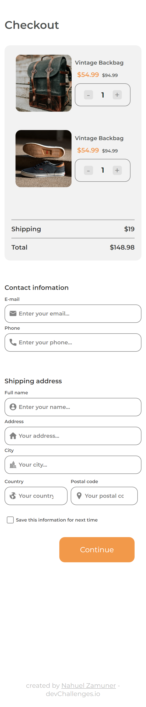

# checkoutPage

Solution for a challenge from [Devchallenges.io](http://devchallenges.io)

<h2>Links</h2>

- [Demo](https://www.figma.com/file/4B0x88GhiZvgVlcQPSQ73D/checkout-page-challenge?node-id=0%3A1)
- [Solution](https://nahuelzamuner.github.io/checkoutPage/)
- [Challenge](https://devchallenges.io/challenges/0J1NxxGhOUYVqihwegfO)

<h2>Overview</h2>
Create a static page with HTML and CSS following the designs.

<h2>Built with:</h2>

- HTML5
- CSS3

<h2>Features</h2>
Responsive purchase form page.

<h2>Contact</h2>

- nahuelzamuner010@gmail.com

<h2>Thanks</h2>

Thanks to the dev Challenge community for the UI layout provided for the project. They are very useful to put our knowledge into practice.

